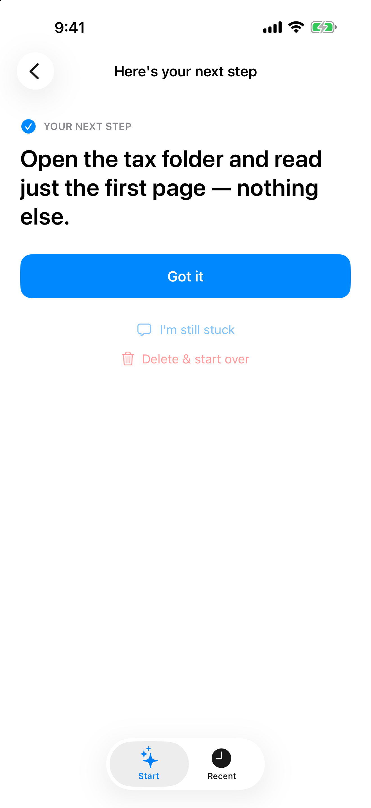
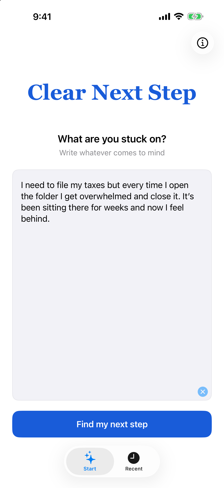
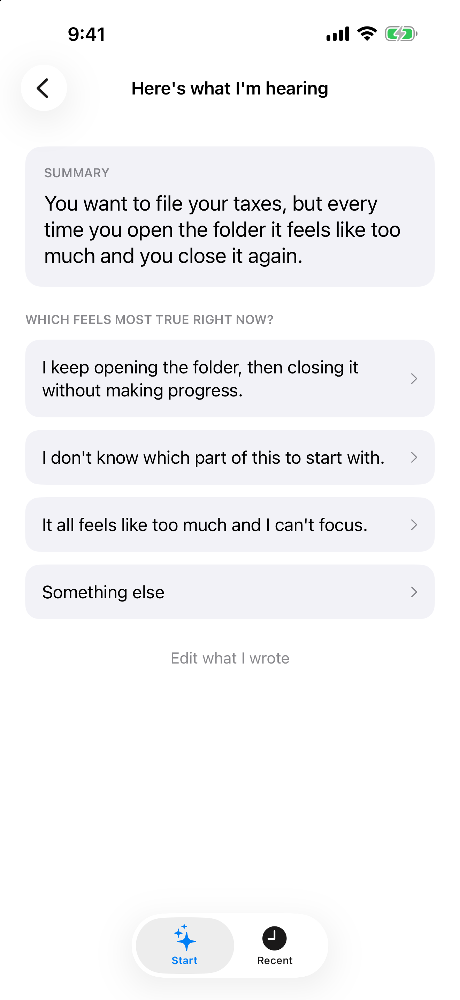
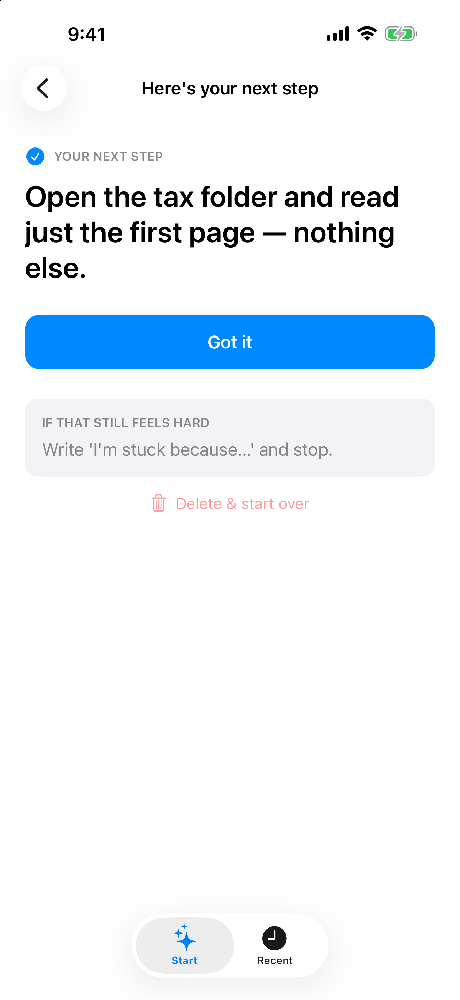
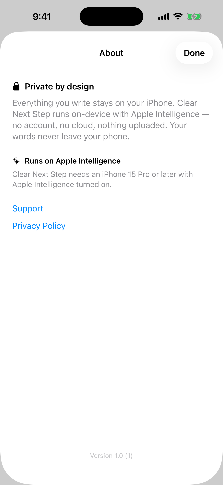

# Clear Next Step

*(repo/bundle: Unstickit)*

**Finds you one small step to get unstuck — not a plan, not a list, just the next move.**

Write down whatever you're stuck on, in your own words. Clear Next Step reflects back what it
hears — your goal, and what might be getting in the way — then offers a few ways you might be
stuck. Pick the one that feels true, and it gives you a single, small step to get moving again.

Everything runs **on-device**, via Apple Intelligence. What you write never leaves your phone.

  
  
  
  
  

## How it works

Three stages, entirely on-device:

1. **Brain dump** — write what's stuck, in your own words.
2. **Reflection + choice** — the app names your goal and what's in the way, then offers a few
   ways you might be stuck; you pick the one that's true.
3. **Next step** — one small, concrete action. Still too much? Ask for a smaller one.

## Engineering highlights

- **On-device AI, not a chatbot wrapper.** Runs entirely on Apple's on-device FoundationModels —
  no network call, no account, nothing collected. The model is a constrained stage inside a
  product loop (three tappable options), not an open text box.
- **Made a limited small model production-safe.** Structured `@Generable` outputs,
  validation, dedup/repair-rerolls, and deterministic per-mode fallbacks so a usable step always
  renders, even when generation fails. See [ADR 0002](Docs/adr/0002-harden-the-unreliable-on-device-model.md).
- **Privacy as architecture, not a setting.** The on-device decision and its tradeoffs are
  captured in [ADR 0001](Docs/adr/0001-keep-unstickit-on-device.md).
- **No blanket MVVM layer, on purpose.** My normal policy is MVVM plus a dedicated service/data
  layer; here I deliberately skipped the ViewModel-per-view layer to see how a small, heavily
  AI-assisted SwiftUI app holds up on `@State`/`@Observable` alone, with a thin service/store
  layer kept underneath. Worked well so far; long-term sustainability is still an open question.
  See [ADR 0007](Docs/adr/0007-skip-mvvm-for-this-app.md).
- **Spec-first, AI-assisted process.** Design and decisions were driven by specs and ADRs before
  code — see [AI_WORKFLOW.md](AI_WORKFLOW.md) and [Docs/adr](Docs/adr).

## Requirements

- iOS 26.0+
- An Apple Intelligence–eligible device (the app gates gracefully on ineligible hardware)

## Status

In final release prep — not yet live on the App Store. [Support & privacy](https://davidrynn.com/clear-next-step/)

---
© 2026 Fieldlight Interactive
